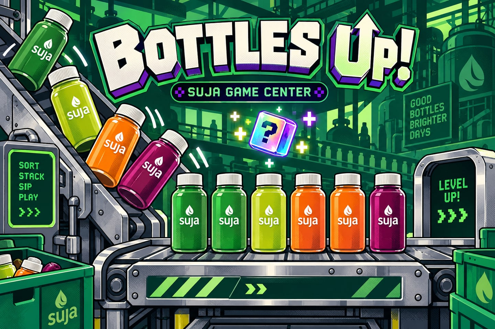

# Bottles Up!

Load the bin. Stand the bottles. Catch the bad ones. Find your flow.

[Play Bottles Up!](https://seansommer.github.io/bottlesup/) · [SUJA Game Center](https://seansommer.github.io/sujagamecenter/)

A 3D conveyor arcade game with three-minute shifts, endless mode, and practice. Control the short feeder, inspect the bottles, and build a full line for the Full Flow bonus.

Tap a fallen bottle to stand it. Use Reject mode for missing labels, crooked caps, and low fills. Load a bin, then hold the raise/lower controls to regulate the pour. The in-game help explains the controls and bonuses.

Sign in through SUJA Game Center before playing to save competitive scores.
